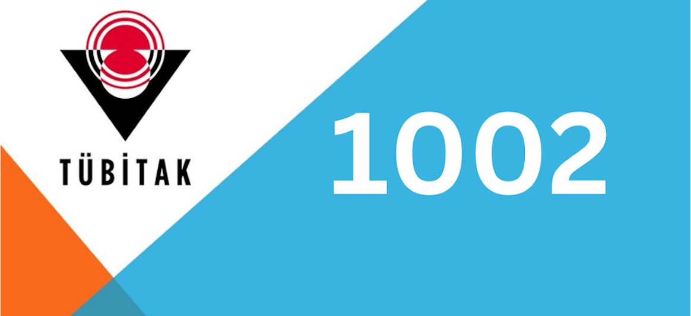
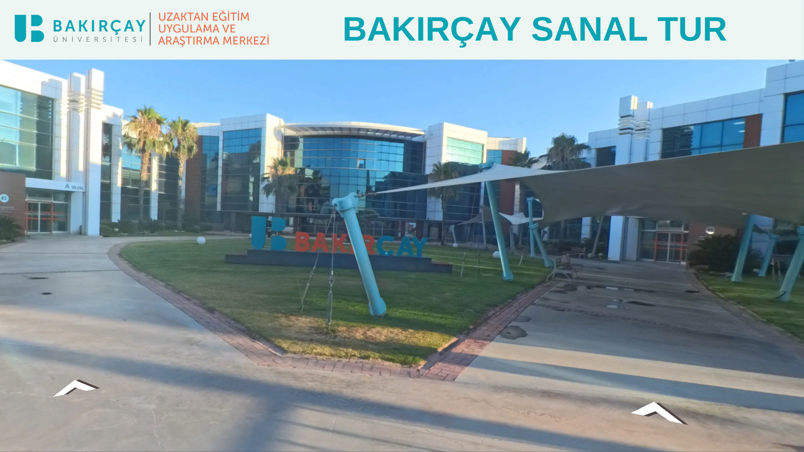
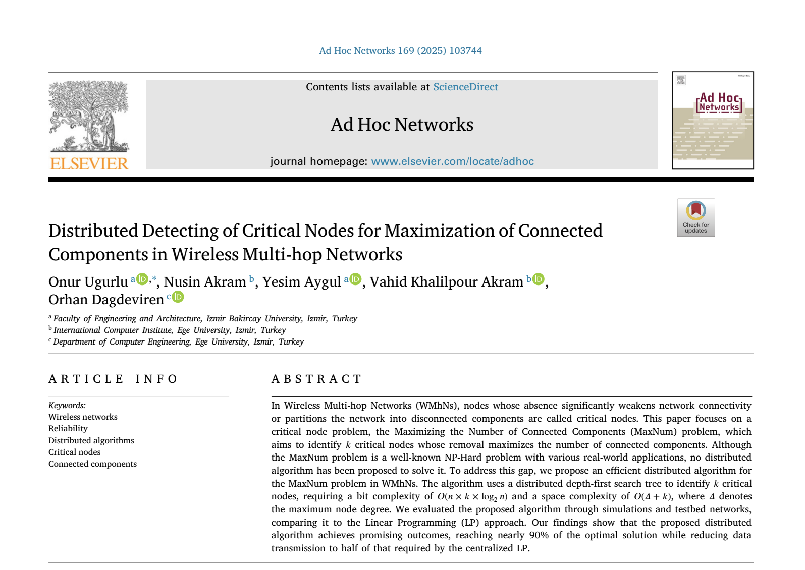
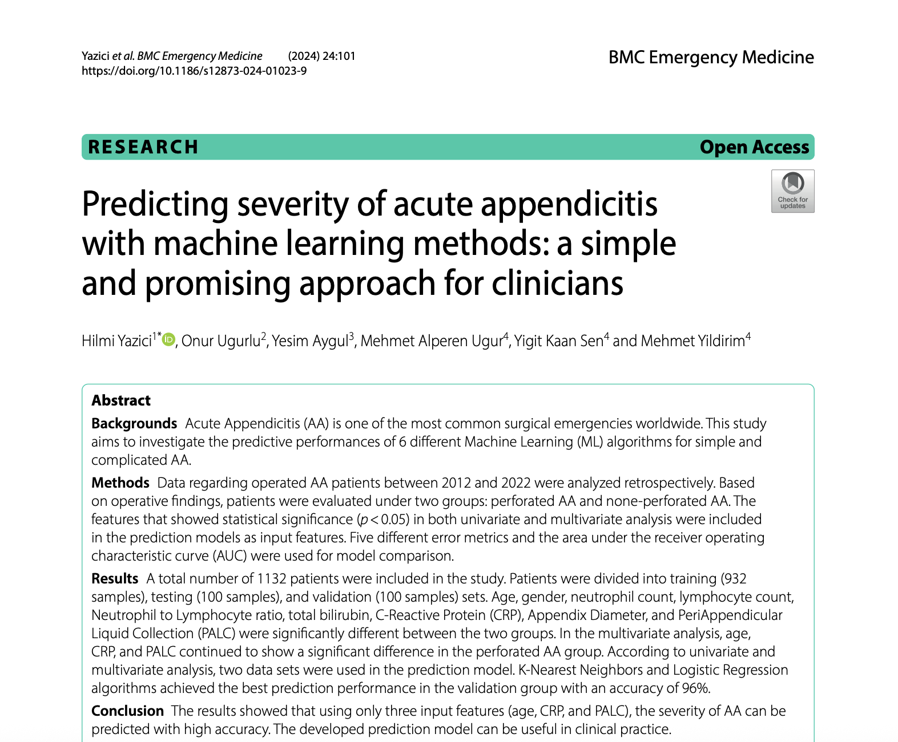
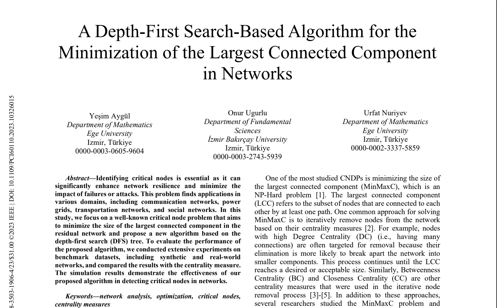

<!DOCTYPE html>
<html lang="en">
<head>
  <meta charset="UTF-8" />
  <meta name="viewport" content="width=device-width, initial-scale=1.0"/>
  <link href="https://unpkg.com/boxicons@2.1.4/css/boxicons.min.css" rel="stylesheet"/>
  <link rel="stylesheet" href="style.css"/>
  <title>Yeşim Aygül | Portfolio</title>
  <meta name="description" content="Network Analysis, Machine Learning, Virtual Reality"/>
</head>

<body>
  <!-- Header -->
  <header>
    <a href="#home" class="logo" aria-label="Home">Yeşim Aygül</a>

    <button class="bx bx-menu" id="menu-icon" aria-label="Toggle menu" aria-expanded="false" aria-controls="navbar"></button>

    <ul class="navbar" id="navbar" role="navigation">
      <li><a href="#home">Home</a></li>
      <li><a href="#about">About</a></li>
      <li><a href="#services">Research Areas</a></li>
      <li><a href="#portfolio">Projects & Publications</a></li>
      <li><a href="#contact">Contact</a></li>
    </ul>

    

      <a href="mailto:yesim.aygul@bakircay.edu.tr" class="nav-btn">Contact Me</a>
    

  </header>

  <!-- Home -->
  <section id="home" class="home">
    

      
    

    

      <h1>Hello, I'm Yeşim</h1>
      <h3></h3>

      

        I am a <strong>Research Assistant</strong> at Izmir Bakircay University, Department of Computer Engineering.  
        My research focuses on <em>Network Analysis</em>, 
        <em>Machine Learning</em>, and <em>Virtual Reality</em>.
      

        

        <a href="https://www.linkedin.com/in/yeşim-aygül-bb2003176"><i class='bx bxl-linkedin' aria-label="LinkedIn"></i></a>
        <a href="https://github.com/Yesim7"><i class='bx bxl-github' aria-label="GitHub"></i></a>
        <a href="https://scholar.google.com/citations?user=bpR9pcQAAAAJ&hl=tr&oi=ao"><i class='bx bxl-google' aria-label="Google Scholar"></i></a>
        
        

      <a href="mailto:yesim.aygul@bakircay.edu.tr" class="btn">Contact Me</a>
    

  </section>

  <!-- About -->
  <section id="about" class="about">
    

      <h2 class="heading">About Me</h2>
        
       

        I completed my <strong>BSc in Mathematics</strong> at Ege University (2020) and my 
        <strong>MSc in Computer Science</strong> at Ege University (2023).  
        Currently, I am pursuing a <strong>PhD in Computer Engineering</strong> at Izmir Bakircay University, 
        where I have been working as a research assistant since April 2024.  

        My doctoral studies are centered on <strong>distributed algorithm design</strong> and its applications in 
        network optimization. My broader research interests include <em>critical element detection in networks</em>, 
        <em>machine learning for healthcare</em>, and <em>Virtual Reality-based training systems</em>.
        

      <a href="#portfolio" class="btn">View My Work</a>
    

    

      
    

  </section>

  <!-- Research Areas -->
  <section class="services" id="services">
    <h2 class="heading">Main Research Areas</h2>

    

      

        
<i class='bx bx-git-branch'></i>

        <h3>Critical Element Detection</h3>
        
Designing centralized and distributed algorithms for detecting critical nodes/edges in multi-hop wireless networks.

      

      

        
<i class='bx bx-pulse'></i>

        <h3>Machine Learning in Healthcare</h3>
        
Prediction of disease severity, survival analysis, and decision support using classical ML and deep learning approaches.

      

      

        
<i class='bx bx-vr'></i>

        <h3>Virtual Reality-based Training</h3>
        
Scenario design and evaluation for occupational safety and campus digitalization using immersive Virtual Reality technologies.

      

    

  </section>

  <!-- Portfolio -->
  <section class="portfolio" id="portfolio">
    <h2 class="heading">Projects</h2>

    

     

      

        
        <h4>Virtual Reality for Occupational Safety Training: Firefighting & Fall Simulation (Researcher, 2025–2026)</h4>
      

      

        
        <h4>EndoAI: Artificial Intelligence-based DSS for Real-Time Polyp Detection (Researcher, 2025–2026 )</h4>
      

      

        
        <h4>Prediction of Survival Time in Colorectal Cancer Patients Using Ensemble Learning ... (Researcher, 2025–2026)</h4>
      

       

        
        <h4>Digitization of University Campuses via Virtual Reality (Researcher, 2025–2026)</h4>
      

      
      

        
        <h4>Design and Analysis of Centralized and Distributed Algorithms for Identifying Critical Elements in Networks (Scholarship, 2021–2023)</h4>
      

      

      <h2 class="heading"> Publications</h2>

      

        
        <h4>Distributed Detecting of Critical Nodes for Maximization of Connected ... (Ad Hoc Networks, 2025)</h4>
      

      

        
        <h4>Predicting Severity of Acute Appendicitis... (BMC Emerg Med, 2024)</h4>
      

      

        
        <h4>A Depth-First Search-Based Algorithm for the Minimization of the Largest Connected Component in Networks (PCI 2023)</h4>
      

    

  </section>

  <!-- Contact -->
  <section id="contact" class="contact">
    <h2 class="heading">Contact Me</h2>
    
    <!-- 
    

      
<i class='bx bx-phone'></i> Phone: +90 534 328 40 59

      
<i class='bx bx-envelope'></i> e-mail: yesim.aygul@bakircay.edu.tr

      
<i class='bx bx-map'></i> Address: Seyrek Campus, Menemen / Izmir

    

    -->

  <form action="https://formspree.io/f/mwprkboe" method="POST">
  

    <input type="text" name="name" placeholder="Full Name" required/>
    <input type="email" name="email" placeholder="Email Address" required/>
  

  

    <input type="tel" name="phone" placeholder="Phone"/>
    <input type="text" name="subject" placeholder="Subject"/>
  

  <textarea name="message" cols="30" rows="10" placeholder="Your Message" required></textarea>

  <!-- İsteğe bağlı: konu başlığı ve başarılı dönüş adresi -->
  <input type="hidden" name="_subject" value="New message from Portfolio"/>

  <!-- Basit honeypot (spam azaltma) -->
  <input type="text" name="_gotcha" style="display:none" tabindex="-1" autocomplete="off"/>

  <input type="submit" value="Send Message" class="btn"/>
</form>

 </script>

    
  <!-- Footer -->
  <footer class="footer">
    

      <a href="https://www.linkedin.com/in/yeşim-aygül-bb2003176"><i class='bx bxl-linkedin'></i></a>
      <a href="https://github.com/Yesim7"><i class='bx bxl-github'></i></a>
      <a href="https://scholar.google.com/citations?user=bpR9pcQAAAAJ&hl=tr&oi=ao"><i class='bx bxl-google'></i></a>
      <a href="https://akademik.yok.gov.tr/AkademikArama/AkademisyenGorevOgrenimBilgileri?islem=direct&authorId=503D379A5CECFD31"><i class='bx bx-book'></i></a>
     
      <a href="https://orcid.org/0000-0003-0605-9604">
      <i class='bx bx-id-card' aria-label="ORCID"></i>
      </a>
        <a href="https://www.researchgate.net/profile/Yesim-Ayguel?ev=hdr_xprf">
            <i class='bx bx-network-chart' aria-label="ResearchGate"></i>
        </a>
        <a href="https://bilgisayar.bakircay.edu.tr/Sayfalar/514/akademik-personel">
            <i class='bx bx-building' aria-label="Institutional Page"></i>
        </a>
    

    

     &copy; Yeşim Aygül | All Rights Reserved
    

  </footer>

  <!-- Scripts -->
  
  
  
 

</body>
</html>

